<!-- generated by tools/generate_gallery.py --write from verification/gallery.json; do not edit -->
# Gallery

**Status:** Living. Generated from `verification/gallery.json` by `tools/generate_gallery.py --write`;
edit the manifest, not this page. The pictures are the latest capture of each fixed path under
`verification/` (the rules in `verification/README.md`); a PR that changes a picture changes it here.

| Host | What it is |
| --- | --- |
| `wgpu` | the wgpu host (hosts/wgpu, hogshade/wgpu_host.py), the shader ball offscreen; the texture cook's pictures are written by the cook itself, no host |
| `maya-2026` | Maya 2026 dx11Shader through hosts/maya_dx11/hogshade.fx, a sphere in the viewport |

## The shader ball in the wgpu host

The same material through the forward path and the deferred pair must agree; the deferred picture carries only the G-buffer's quantisation and the depth-reconstructed view vector.

### legacy v2, forward path (`wgpu`)

content/materials/legacy-v2/default.material.json under studio_small_09: the schema's defaults (roughness 0.5, IOR 1.45, base colour 0.6). Made by `uv run tools/wgpu/viewport.py`; the file is `verification/wgpu/shader-ball/studio_small_09/forward.png`.

### legacy v2, deferred path (`wgpu`)

the same material through the G-buffer fill and the deferred light pass. Made by `uv run tools/wgpu/viewport.py`; the file is `verification/wgpu/shader-ball/studio_small_09/deferred.png`.

### legacy v2 metal, forward path (`wgpu`)

content/materials/legacy-v2/metal.material.json: metalness 1, roughness 0.2. Made by `uv run tools/wgpu/viewport.py --material content/materials/legacy-v2/metal.material.json --variant metal`; the file is `verification/wgpu/shader-ball/studio_small_09/metal/forward.png`.

### legacy v2 metal, deferred path (`wgpu`)

the metal through the deferred pair. Made by `uv run tools/wgpu/viewport.py --material content/materials/legacy-v2/metal.material.json --variant metal`; the file is `verification/wgpu/shader-ball/studio_small_09/metal/deferred.png`.

### legacy v1, forward path (`wgpu`)

content/materials/legacy-v1/default.material.json: the 2015 Disney model. Made by `uv run tools/wgpu/viewport.py --material content/materials/legacy-v1/default.material.json --variant legacy-v1`; the file is `verification/wgpu/shader-ball/studio_small_09/legacy-v1/forward.png`.

### legacy v1, deferred path (`wgpu`)

the v1 model through the deferred pair. Made by `uv run tools/wgpu/viewport.py --material content/materials/legacy-v1/default.material.json --variant legacy-v1`; the file is `verification/wgpu/shader-ball/studio_small_09/legacy-v1/deferred.png`.

### Side by side

| Left | Right | Why |
| --- | --- | --- |
|  |  | forward against deferred, legacy v2: the tool prints the mean and max difference over the ball's pixels |
|  |  | legacy v2 against legacy v1, forward path, the same lights and environment |

## The library of materials, the contact sheet

Every standard document of the base library (S4a) renders through the reverse conversion table and the wgpu host; the sheet is the human gate: the metals tell apart, gold is gold, the lacquer is red, the leaf is green. The legend beside it names every cell.

### the base library, 26 documents, forward path (`wgpu`)

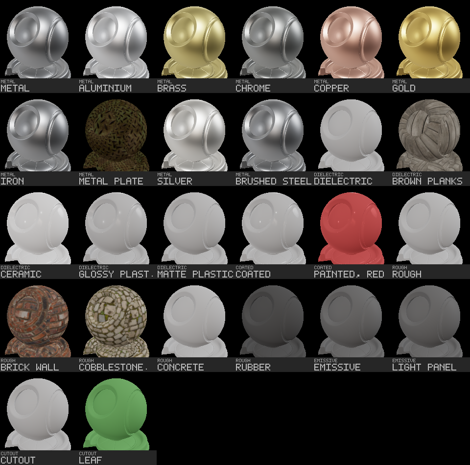

content/materials/standard/ in roster order, six to a row, each cell labelled with its family and title (a long title is cut with a dot; contact-sheet.json has it whole): metal (base, aluminium, brass, chrome, copper, gold, iron, metal plate, silver, brushed steel), dielectric (base, brown planks, ceramic, glossy plastic, matte plastic), coated (base, painted red), rough (base, brick wall, cobblestone floor, concrete, rubber), emissive (base, panel), cutout (base, leaf); contact-sheet.json is the legend. The emissive pair do not glow: the wgpu host carries no emission term, so they render as their dark base colour; anisotropy, specular colour and specular occlusion are the table's losses, so brushed steel is iron here; the four T3 documents (brick wall, cobblestone floor, brown planks, metal plate) render their cooked sets on the host's texture slots (T3b), the other twenty-two their constants on neutral slots. Made by `uv run tools/wgpu/contact_sheet.py`; the file is `verification/wgpu/library/contact-sheet.png`.

## The sphere in Maya 2026

The dx11Shader shell loads the generated core and the schema-generated material UI, decodes the cooked cubes and the LUT, and renders under the calibration environment; the debug views prove the lobes reach the viewport.

### legacy v2, the Main technique (`maya-2026`)

the IBL check on the resident hogshade_maya_gui worker; after S2 the material block of the shell is generated and renders pixel-identical to the hand-written one. Made by `JOB_ORCHESTRATOR/.venv/Scripts/python.exe tools/bats/submit.py --gui --main-thread --module hogshade.jobs.maya_ibl_check --param variant=studio_small_09 (debug_modes default 18,27,28; the job's default material: base 0.5, roughness 0.2, specular 1.0, IOR 1.5)`; the file is `verification/maya-2026/ibl-check/studio_small_09/main.png`.

### legacy v2, debug view 18 (specular) (`maya-2026`)

the specular accumulator alone. Made by `JOB_ORCHESTRATOR/.venv/Scripts/python.exe tools/bats/submit.py --gui --main-thread --module hogshade.jobs.maya_ibl_check --param variant=studio_small_09 (debug_modes default 18,27,28; the job's default material: base 0.5, roughness 0.2, specular 1.0, IOR 1.5)`; the file is `verification/maya-2026/ibl-check/studio_small_09/debug-18.png`.

### legacy v2, debug view 27 (`maya-2026`)

the environment term. Made by `JOB_ORCHESTRATOR/.venv/Scripts/python.exe tools/bats/submit.py --gui --main-thread --module hogshade.jobs.maya_ibl_check --param variant=studio_small_09 (debug_modes default 18,27,28; the job's default material: base 0.5, roughness 0.2, specular 1.0, IOR 1.5)`; the file is `verification/maya-2026/ibl-check/studio_small_09/debug-27.png`.

### legacy v2, debug view 28 (`maya-2026`)

the direct term. Made by `JOB_ORCHESTRATOR/.venv/Scripts/python.exe tools/bats/submit.py --gui --main-thread --module hogshade.jobs.maya_ibl_check --param variant=studio_small_09 (debug_modes default 18,27,28; the job's default material: base 0.5, roughness 0.2, specular 1.0, IOR 1.5)`; the file is `verification/maya-2026/ibl-check/studio_small_09/debug-28.png`.

### legacy v1, the Main technique (`maya-2026`)

the Shading Model dropdown at Legacy v1, sheen 0.5, clearcoat 0.5. Made by `JOB_ORCHESTRATOR/.venv/Scripts/python.exe tools/bats/submit.py --gui --main-thread --module hogshade.jobs.maya_ibl_check --param variant=legacy-v1/studio_small_09 --param debug_modes=2,8 --param set=shadingModel=1,materialSpecular=0.5,materialSheen=0.5,materialClearcoat=0.5,materialClearcoatGloss=0.8`; the file is `verification/maya-2026/ibl-check/legacy-v1/studio_small_09/main.png`.

### legacy v1, debug view 2 (`maya-2026`)

a v1 debug view. Made by `JOB_ORCHESTRATOR/.venv/Scripts/python.exe tools/bats/submit.py --gui --main-thread --module hogshade.jobs.maya_ibl_check --param variant=legacy-v1/studio_small_09 --param debug_modes=2,8 --param set=shadingModel=1,materialSpecular=0.5,materialSheen=0.5,materialClearcoat=0.5,materialClearcoatGloss=0.8`; the file is `verification/maya-2026/ibl-check/legacy-v1/studio_small_09/debug-02.png`.

### legacy v1, debug view 8 (`maya-2026`)

a v1 debug view. Made by `JOB_ORCHESTRATOR/.venv/Scripts/python.exe tools/bats/submit.py --gui --main-thread --module hogshade.jobs.maya_ibl_check --param variant=legacy-v1/studio_small_09 --param debug_modes=2,8 --param set=shadingModel=1,materialSpecular=0.5,materialSheen=0.5,materialClearcoat=0.5,materialClearcoatGloss=0.8`; the file is `verification/maya-2026/ibl-check/legacy-v1/studio_small_09/debug-08.png`.

### the E1 diffuse-term check (legacy v2 shader, debug view 27) (`maya-2026`)

the irradiance cube's diffuse term in the legacy v2 shader itself, the IBL cook's first proof in Maya; renamed from diffuse-term.png to the name the check writes. Made by `set MAYA_VP2_DEVICE_OVERRIDE=VirtualDeviceDx11 HOGSHADE_ROOT=D:/Depot/HogShade HOGSHADE_FX=legacy/v2.0/V2_uv0bn-pbs_IBLenv.fx HOGSHADE_CHECK=legacy-v2-ibl HOGSHADE_DEBUG_MODES=27 HOGSHADE_SET=linearSpaceLighting=0; maya.exe -script tools/maya/ibl_check.mel (E1, 2026-09-20, before the BATS job existed; writes debug-27.png)`; the file is `verification/maya-2026/legacy-v2-ibl/studio_small_09/debug-27.png`.

### Side by side

| Left | Right | Why |
| --- | --- | --- |
|  |  | Maya against wgpu today: different mesh, camera, resolution and output space, so not yet comparable; the comparison framework (track E, gate G4) is what makes this pair a diff |

## The texture cook: frequency separation

The owner's technique as a cook operation: the low-pass and the high-pass of a sourced colour map recombine to the source under a linear-light blend, within one 8-bit step; the macro colour can be stored at a few texels and the detail at full resolution.

### the source colour map (Poly Haven cobblestone_floor_04, CC0, 1K, shown at 512) (`wgpu`)

the post's own example set, cooked outside the repository as T2's proof; the set itself lands with T3. Made by `uv run tools/cook_textures.py separate <set> --radius 16 --macro 64 --picture verification/wgpu/textures/cobblestone_floor_04 --picture-size 512`; the file is `verification/wgpu/textures/cobblestone_floor_04/source.png`.

### the low-pass (sigma 8, radius 16), wrap-padded so it tiles (`wgpu`)

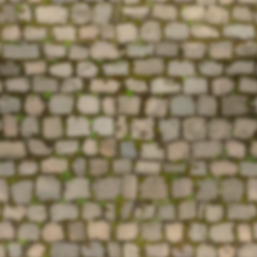

what the macro colour map carries; the cook stores it at 64x64. Made by `the same command`; the file is `verification/wgpu/textures/cobblestone_floor_04/low.png`.

### the high-pass about mid-grey, the detail map T_cobblestone_floor_04_DH (`wgpu`)

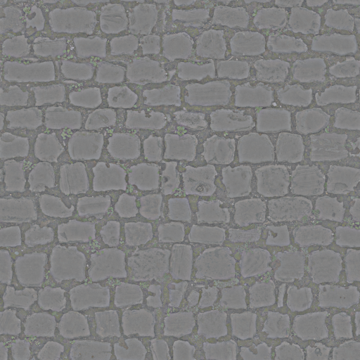

8-bit quantised, as written; neutral grey where the source equals its low-pass. Made by `the same command`; the file is `verification/wgpu/textures/cobblestone_floor_04/high.png`.

### the recombination, saturate(low + 2 * high - 1) (`wgpu`)

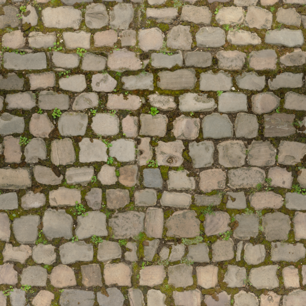

the manifest measures it: error max 0.0039 (one 8-bit step), mean 0.0020, 440 of 1048576 texels clipped. Made by `the same command`; the file is `verification/wgpu/textures/cobblestone_floor_04/recombined.png`.

### the brick wall's source colour map (brick_wall_001, 2K, shown at 512) (`wgpu`)

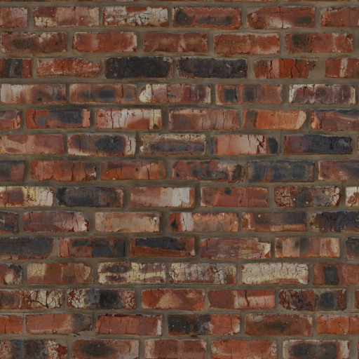

the committed set, separated with --compress. Made by `uv run tools/cook_textures.py separate content/materials/standard/rough/brick_wall_001 --radius 16 --macro 64 --compress --picture verification/wgpu/textures/brick_wall_001 --picture-size 512`; the file is `verification/wgpu/textures/brick_wall_001/source.png`.

### the brick wall's high-pass about mid-grey (`wgpu`)

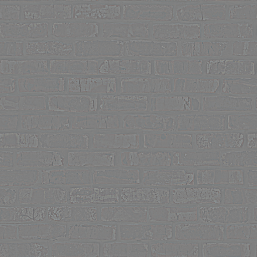

the mortar lines and the brick texture; the low frequency is in the macro. Made by `uv run tools/cook_textures.py separate content/materials/standard/rough/brick_wall_001 --radius 16 --macro 64 --compress --picture verification/wgpu/textures/brick_wall_001 --picture-size 512`; the file is `verification/wgpu/textures/brick_wall_001/high.png`.

### Side by side

| Left | Right | Why |
| --- | --- | --- |
|  |  | the source against its recombination: the difference is the 8-bit quantisation of the high-pass and nothing else |

## The first texture set

T3: the repository's first texture content, four Poly Haven sets and the legacy grid tile, cooked block-compressed and rendered on the Maya shell from their standard documents; the probe that decided the encoding is in the same directory. T3b: the same five sets through the wgpu host from the same cooked DDS, beside the Maya captures in the matrix below (sets as rows, hosts as columns). The two will not match pixel for pixel: a different mesh (the shader ball against Maya's sphere), camera and output space; the comparison framework after gate G4 is what makes them a diff. A human can see the same brick, the same metalness.

### the ground: T2's proof set at 2K, height as R16_UNORM; BC7 colour, BC5 normal, the packed ORM through ormMap (`maya-2026`)

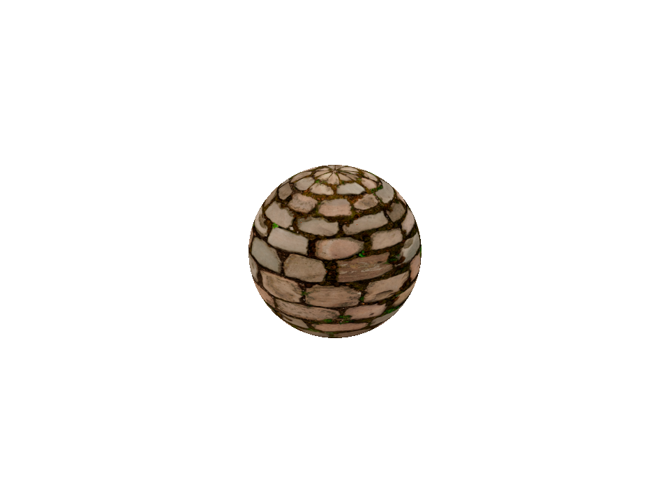

the standard document cobblestone_floor_04.material.json converted to legacy v2 and bound; every DDS connected through the set's manifest. Made by `"%JOB_ORCHESTRATOR_ROOT%\.venv\Scripts\python.exe" tools/bats/submit.py --gui --main-thread --module hogshade.jobs.maya_texture_check --param set_dir=content/materials/standard/rough/cobblestone_floor_04 --param document=content/materials/standard/rough/cobblestone_floor_04.material.json --param check=textures --param variant=cobblestone_floor_04`; the file is `verification/maya-2026/textures/cobblestone_floor_04/main.png`.

### the brick: strong relief in the normal and the height; BC7 colour, BC5 normal, the packed ORM through ormMap (`maya-2026`)

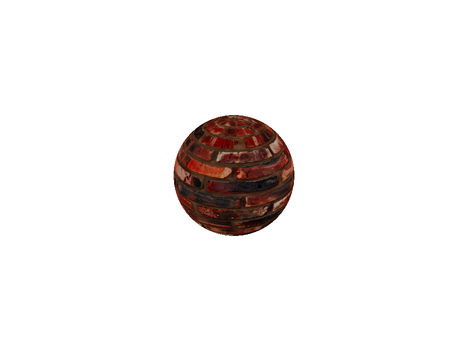

the standard document brick_wall_001.material.json converted to legacy v2 and bound; every DDS connected through the set's manifest. Made by `"%JOB_ORCHESTRATOR_ROOT%\.venv\Scripts\python.exe" tools/bats/submit.py --gui --main-thread --module hogshade.jobs.maya_texture_check --param set_dir=content/materials/standard/rough/brick_wall_001 --param document=content/materials/standard/rough/brick_wall_001.material.json --param check=textures --param variant=brick_wall_001`; the file is `verification/maya-2026/textures/brick_wall_001/main.png`.

### the wood: a plain dielectric, the grain's anisotropy left to a later standard; BC7 colour, BC5 normal, the packed ORM through ormMap (`maya-2026`)

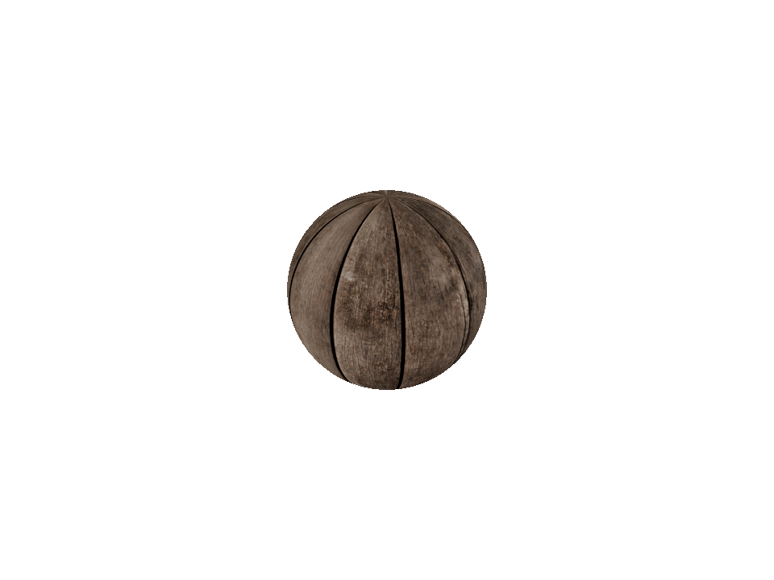

the standard document brown_planks_03.material.json converted to legacy v2 and bound; every DDS connected through the set's manifest. Made by `"%JOB_ORCHESTRATOR_ROOT%\.venv\Scripts\python.exe" tools/bats/submit.py --gui --main-thread --module hogshade.jobs.maya_texture_check --param set_dir=content/materials/standard/dielectric/brown_planks_03 --param document=content/materials/standard/dielectric/brown_planks_03.material.json --param check=textures --param variant=brown_planks_03`; the file is `verification/maya-2026/textures/brown_planks_03/main.png`.

### the metal: the one set with a metalness map, so the ORM carries all three channels; BC7 colour, BC5 normal, the packed ORM through ormMap (`maya-2026`)

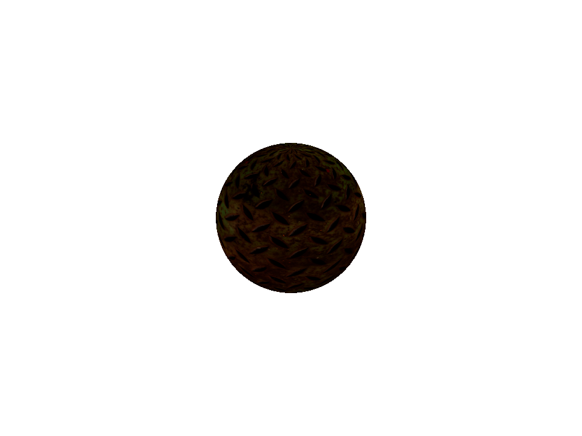

the standard document metal_plate.material.json converted to legacy v2 and bound; every DDS connected through the set's manifest. Made by `"%JOB_ORCHESTRATOR_ROOT%\.venv\Scripts\python.exe" tools/bats/submit.py --gui --main-thread --module hogshade.jobs.maya_texture_check --param set_dir=content/materials/standard/metal/metal_plate --param document=content/materials/standard/metal/metal_plate.material.json --param check=textures --param variant=metal_plate`; the file is `verification/maya-2026/textures/metal_plate/main.png`.

### the calibration tile, the owner's legacy grid at 1K: colour, normal, height, roughness, metalness, AO, emission and cavity (`maya-2026`)

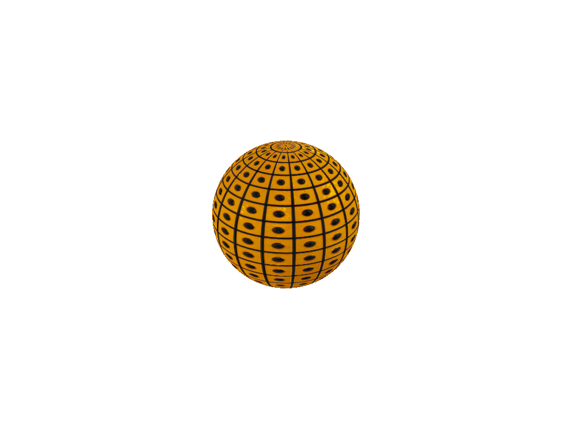

no document binds it; the check builds one from the set's maps (hogshade.material.sets). Made by `"%JOB_ORCHESTRATOR_ROOT%\.venv\Scripts\python.exe" tools/bats/submit.py --gui --main-thread --module hogshade.jobs.maya_texture_check --param set_dir=content/textures/grid --param check=textures --param variant=grid`; the file is `verification/maya-2026/textures/grid/main.png`.

### the ground through the wgpu host: BC7 colour, BC5 normal, the packed ORM's green as roughness and red as AO (`wgpu`)

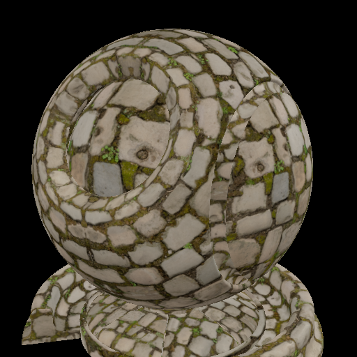

the standard document converted to legacy v2 and bound; every map the runtime reports handed to the host, the plan logging the ones without a slot. Made by `uv run tools/wgpu/texture_matrix.py`; the file is `verification/wgpu/textures/cobblestone_floor_04/main.png`.

### the brick through the wgpu host: the relief is the BC5 normal on the mesh's MikkTSpace tangents (`wgpu`)

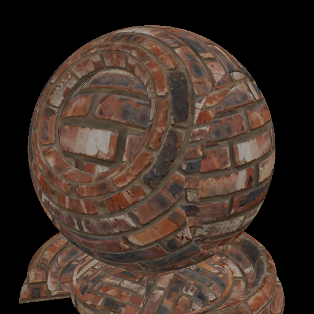

the standard document converted to legacy v2 and bound; every map the runtime reports handed to the host, the plan logging the ones without a slot. Made by `uv run tools/wgpu/texture_matrix.py`; the file is `verification/wgpu/textures/brick_wall_001/main.png`.

### the wood through the wgpu host: a plain dielectric, colour, normal, roughness and AO (`wgpu`)

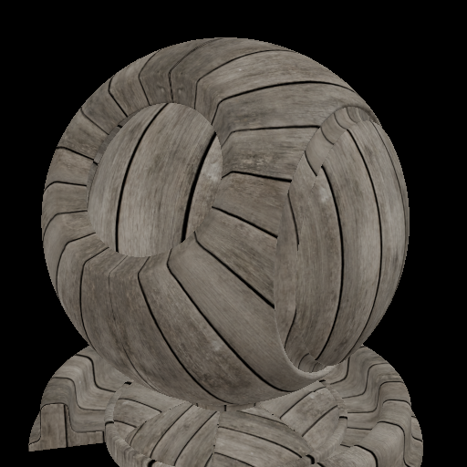

the standard document converted to legacy v2 and bound; every map the runtime reports handed to the host, the plan logging the ones without a slot. Made by `uv run tools/wgpu/texture_matrix.py`; the file is `verification/wgpu/textures/brown_planks_03/main.png`.

### the metal through the wgpu host: the one set whose ORM carries all three channels, metalness from blue (`wgpu`)

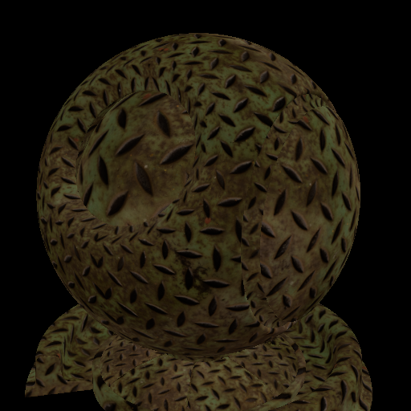

the standard document converted to legacy v2 and bound; every map the runtime reports handed to the host, the plan logging the ones without a slot. Made by `uv run tools/wgpu/texture_matrix.py`; the file is `verification/wgpu/textures/metal_plate/main.png`.

### the calibration tile through the wgpu host: colour, normal, ORM and the BC4 cavity; emission and height have no slot and stay at their factors (`wgpu`)

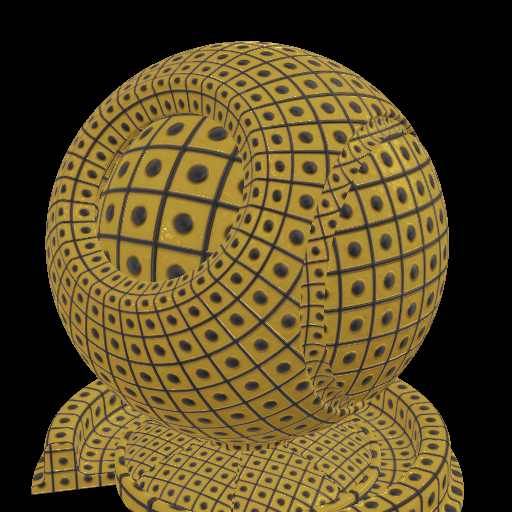

no document binds it; the tool builds one from the set's maps (hogshade.material.sets), as the Maya check does. Made by `uv run tools/wgpu/texture_matrix.py`; the file is `verification/wgpu/textures/grid/main.png`.

### the metalness debug view of the metal plate: the ORM's blue channel read through ormMap (`maya-2026`)

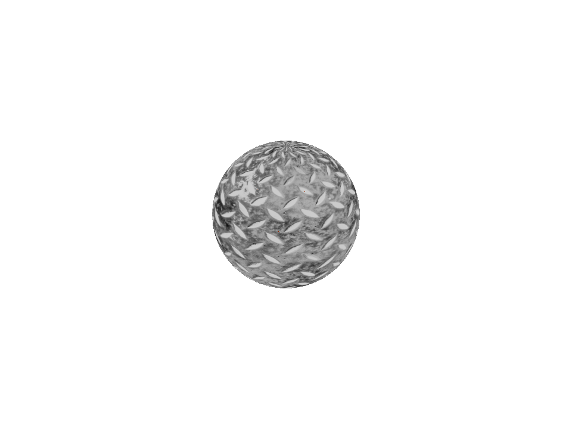

the first draft of the shell read metalness from green; the packed map made that visible. Made by `"%JOB_ORCHESTRATOR_ROOT%\.venv\Scripts\python.exe" tools/bats/submit.py --gui --main-thread --module hogshade.jobs.maya_texture_check --param set_dir=content/materials/standard/metal/metal_plate --param document=content/materials/standard/metal/metal_plate.material.json --param check=textures --param variant=metal_plate`; the file is `verification/maya-2026/textures/metal_plate/debug-07.png`.

### the S2 gate, left: master's shell on the untextured shader ball (`maya-2026`)

rendered in the same Maya session as the right-hand picture, minutes apart. Made by `"%JOB_ORCHESTRATOR_ROOT%\.venv\Scripts\python.exe" tools/bats/submit.py --gui --main-thread --module hogshade.jobs.maya_ibl_check --param check=ibl-check --param variant=gate/master --param fx=<absolute path of a copy of master's hosts/maya_dx11/hogshade.fx>`; the file is `verification/maya-2026/ibl-check/gate/master/main.png`.

### the S2 gate, right: the regenerated shell with ormMap, untextured (`maya-2026`)

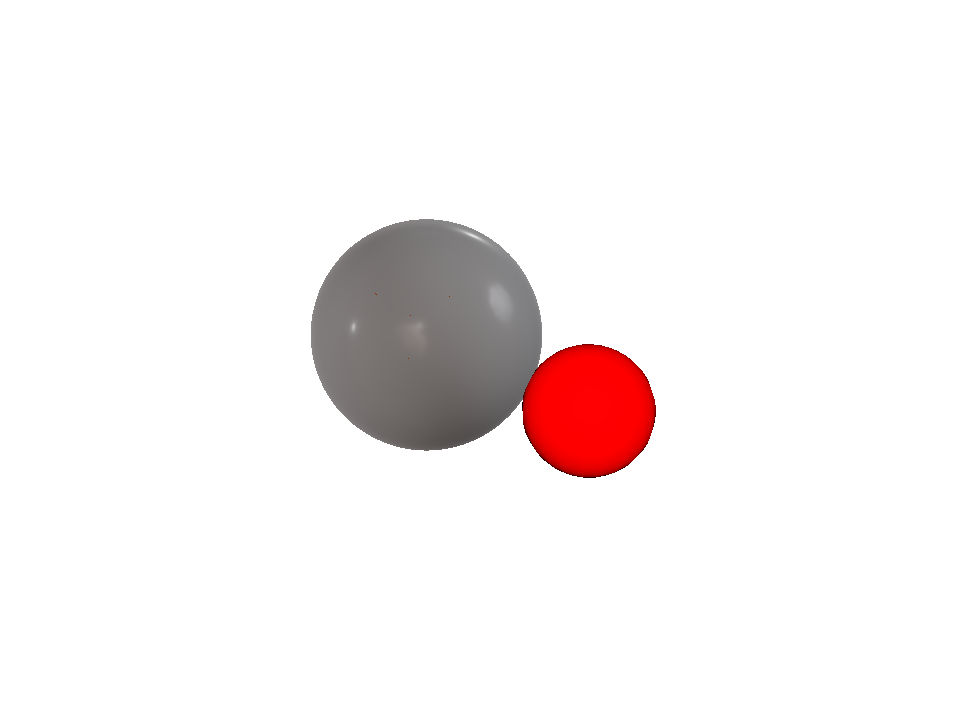

identical to the left on the main view (0 differing pixels); two debug views differ on at most two pixels by one 8-bit step between any two renders, master against itself included. Made by `"%JOB_ORCHESTRATOR_ROOT%\.venv\Scripts\python.exe" tools/bats/submit.py --gui --main-thread --module hogshade.jobs.maya_ibl_check --param check=ibl-check --param variant=gate/ormmap --param fx=<absolute path of hosts/maya_dx11/hogshade.fx>`; the file is `verification/maya-2026/ibl-check/gate/ormmap/main.png`.

### Side by side

| Left | Right | Why |
| --- | --- | --- |
|  |  | the S2 gate for the shell change: master's shell and the regenerated one (with ormMap) rendered untextured in one Maya session; the main view pixel-identical, the debug views within one 8-bit step on at most two pixels (the viewport's own run-to-run jitter) |

### The five sets, Maya beside wgpu

one cooked set per row, rendered from the same DDS by the two hosts: Maya 2026 through the dx11 shell (a sphere, the viewport's camera), the wgpu host (the shader ball, offscreen). Same colour, same normal relief, same metalness; the differences are mesh, camera and output space, not the material

| | Maya 2026 | wgpu |
| --- | --- | --- |
| **cobblestone_floor_04** |  |  |
| **brick_wall_001** |  |  |
| **brown_planks_03** |  |  |
| **metal_plate** |  |  |
| **grid** |  |  |

## Wanted, not yet captured

- the hero scene in every rendering path (the comparison framework, after gate G4)
- parallax occlusion: with and without, in the Maya shell (a job that captures it)
- the base library in Maya, the same sheet through the comparison framework (track E, after G4)
