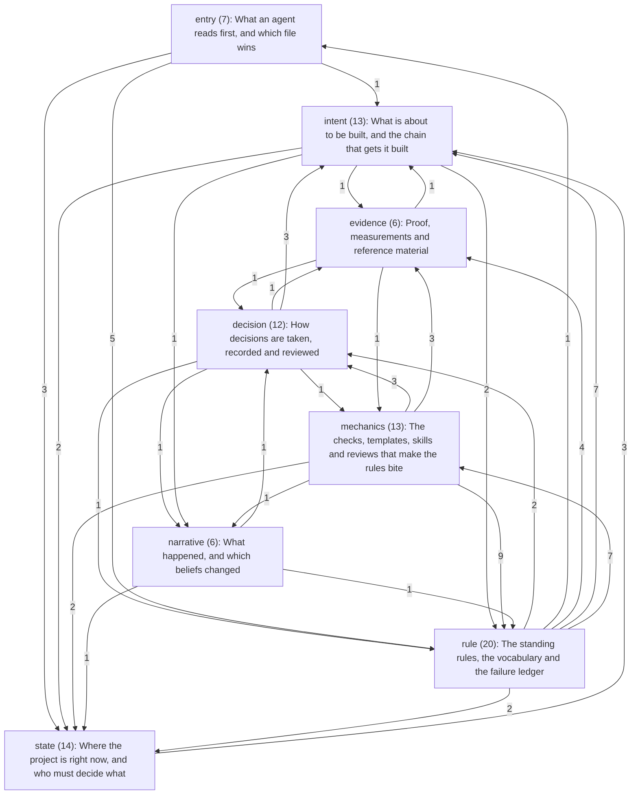
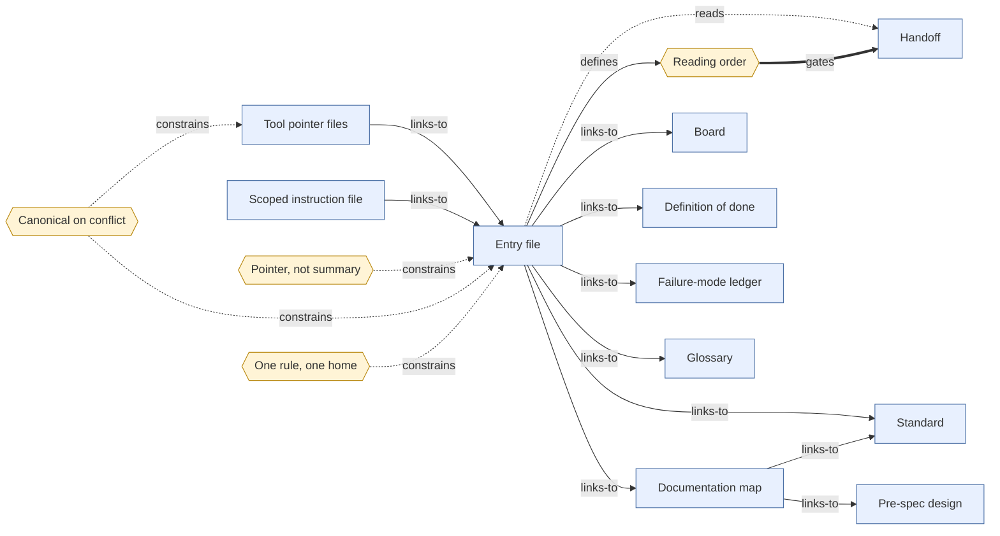
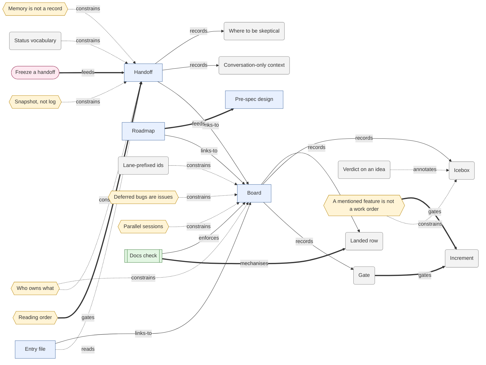
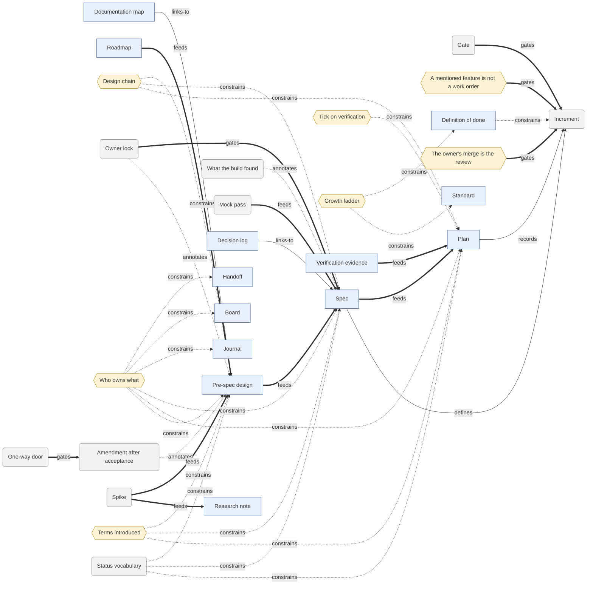
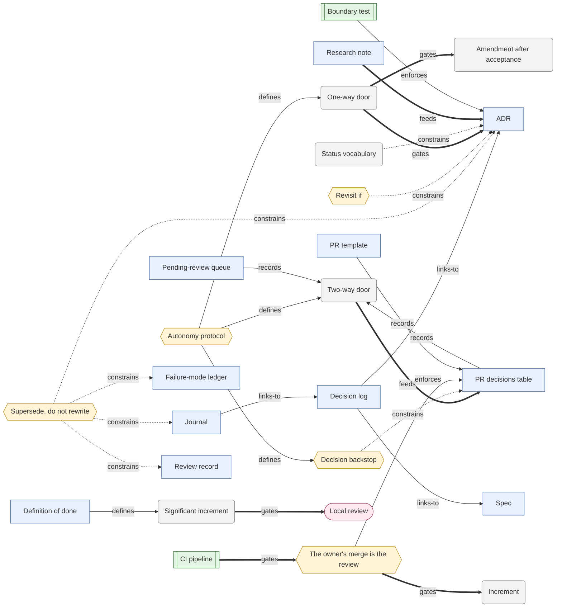
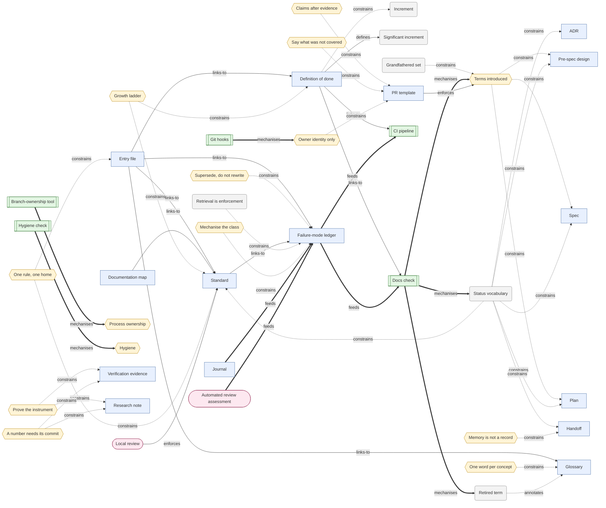
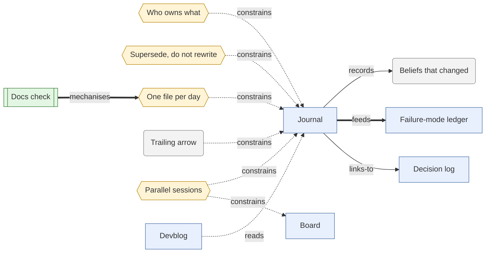
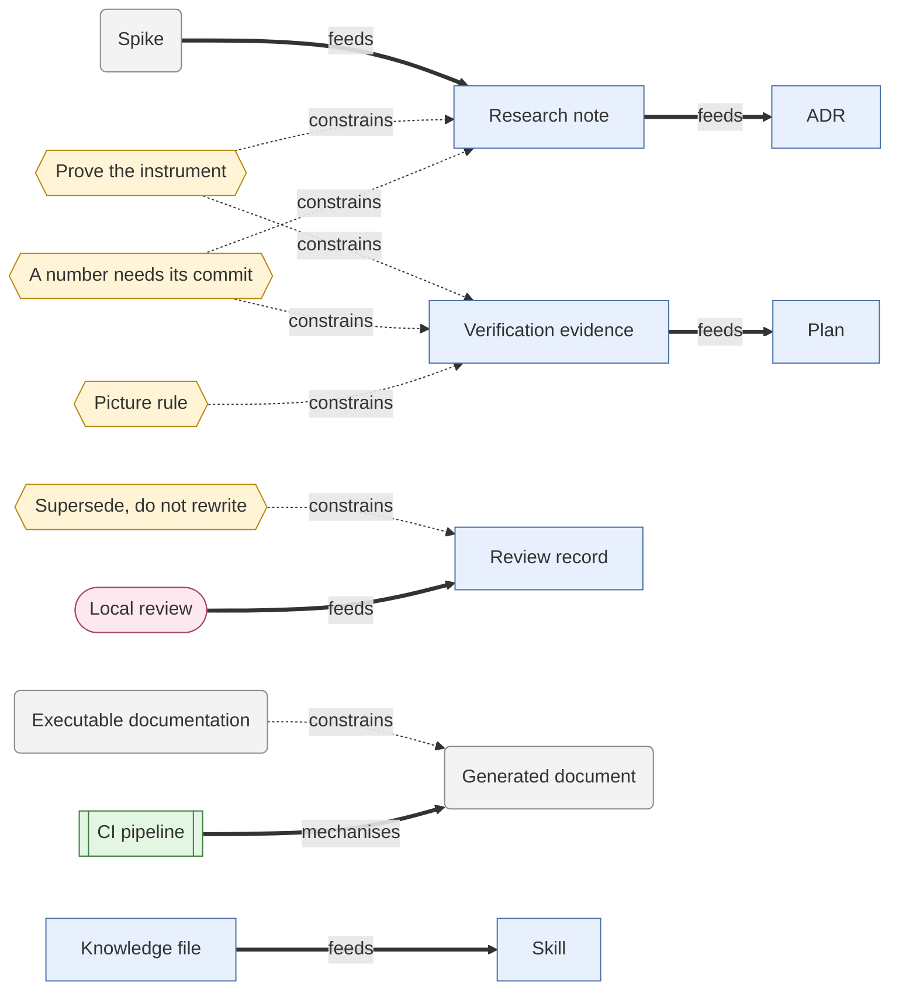
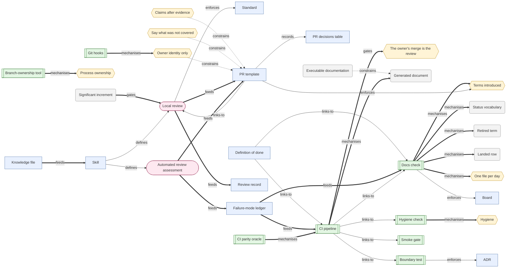

<!-- generated by tools/render_framework_graph.py --write from ai-first-framework.graph.json; do not edit -->
# The AI-first framework graph

**Status:** Living. Generated from `ai-first-framework.graph.json` by `tools/render_framework_graph.py --write`; edit the data, not this page. The description is [ai-first-framework.md](ai-first-framework.md).

91 concepts in 8 layers, joined by 145 typed edges. Nothing here names a project. *Seen in* says where a concept exists today: **H** HogShade, **L** LargeWorlds, **S** SpriteJammer.

## Reading the diagrams

Shapes say what a node is: a rectangle is an artifact (a file or directory), a rounded box a concept, a hexagon a rule, a double-bordered box a check (it goes red), a stadium a ritual. Arrows say how: a thick arrow is a flow that must happen (`feeds`, `gates`, `mechanises`), a plain arrow is a reference or a record, a dotted arrow a constraint or an annotation. Every edge is labelled with its relation.

| Relation | Meaning |
| --- | --- |
| `links-to` | A points at B (23) |
| `reads` | A is read before or with B (2) |
| `records` | A holds a record of B (10) |
| `feeds` | A's output is B's input (18) |
| `gates` | B may not proceed until A passes (9) |
| `enforces` | A makes B binding (5) |
| `mechanises` | A is the automatic check for rule B (10) |
| `constrains` | A bounds how B is written or used (55) |
| `defines` | A is where B is defined (8) |
| `annotates` | A is a mark carried by B (5) |

## The layers

Edge counts between layers; edges inside one layer are in the layer's own diagram below.

## Entry: What an agent reads first, and which file wins

| Concept | Kind | Seen in | What it is |
| --- | --- | --- | --- |
| **Entry file** (`entry-file`) | artifact | HLS | The tool-neutral map every agent reads first: golden rules and links to topic files; it carries no state. |
| **Tool pointer files** (`tool-pointer`) | artifact | HLS | Thin per-tool files that import or point at the entry file and add only that tool's quirks. |
| **Scoped instruction file** (`scoped-instructions`) | artifact | HL | A nested instruction file for one area (a package, a tool), subordinate to the entry file. |
| **Documentation map** (`docs-map`) | artifact | HLS | A task-to-document table: if you are doing X, read Y in this order. |
| **Reading order** (`reading-order`) | rule | HLS | The entry file states what to read first, in order: the handoff, then the board, then the rest. |
| **Pointer, not summary** (`pointer-not-summary`) | rule | HLS | The entry file points and never states counts, phase or status, because a pointer does not go stale. |
| **Canonical on conflict** (`canonical-on-conflict`) | rule | HLS | One file wins where two disagree on a fact; the other is a bug to fix. |

## State: Where the project is right now, and who must decide what

| Concept | Kind | Seen in | What it is |
| --- | --- | --- | --- |
| **Handoff** (`handoff`) | artifact | HLS | The living snapshot a new session reads first: state, work in flight, and what the owner said that is written nowhere else. |
| **Board** (`board`) | artifact | HLS | The tracker: gates, now, next, blocked and the icebox. Status lives here and nowhere else. |
| **Roadmap** (`roadmap`) | artifact | HS | The tracks, phases and order of work; amended as decisions land; not the tracker. |
| **Gate** (`gate`) | concept | HLS | A decision only the owner can make; nothing downstream of an open gate may be committed to. |
| **Icebox** (`icebox`) | concept | HLS | Where every idea said out loud lands, with a cost and a reason; an empty icebox means ideas are going missing. |
| **Verdict on an idea** (`idea-verdict`) | concept | H | A one-line judgement (awesome, good, meh) that orders an idea and never deletes it. |
| **A mentioned feature is not a work order** (`not-a-work-order`) | rule | HLS | An idea goes on the board with a cost; it is built only when the owner says so, it blocks work in flight, or it is smaller than the conversation about it. |
| **Landed row** (`landed-row`) | concept | HL | A finished board row is struck through and keeps its PR number; nothing is deleted. |
| **Snapshot, not log** (`snapshot-not-log`) | rule | HLS | The handoff states now; history belongs to the journal and to git, so the handoff never accretes sit reps. |
| **Conversation-only context** (`conversation-only-context`) | concept | HLS | What the owner said that is written nowhere else (preferences, rejected options): recorded first in the handoff, or it is lost. |
| **Where to be skeptical** (`skeptic-list`) | concept | HLS | The handoff names the documents and claims known to be stale or soft, so a reader knows what not to trust. |
| **Freeze a handoff** (`freeze`) | ritual | LS | Copy the handoff to a dated file and cut the live one to what is still true; used when a phase closes. |
| **Lane-prefixed ids** (`lane-ids`) | concept | S | A session mints board ids only in its own lane, against the main branch, so two sessions never mint the same id. |
| **Deferred bugs are issues** (`deferred-bug-as-issue`) | rule | S | The board tracks features, spikes and gates; a deferred defect is a tracker issue opened before the PR merges. |

## Intent: What is about to be built, and the chain that gets it built

| Concept | Kind | Seen in | What it is |
| --- | --- | --- | --- |
| **Pre-spec design** (`pre-spec-design`) | artifact | HLS | The hand-written lock of the problem, the options and the decisions, written before any spec. |
| **Spec** (`spec`) | artifact | HLS | One increment's exact deliverable, interfaces, acceptance gate and out-of-scope list. |
| **Plan** (`plan`) | artifact | HLS | The ordered, checkbox tasks for one increment, each small enough to verify. |
| **Increment** (`increment`) | concept | HLS | One reviewable unit of work with its own spec, plan, pull request and close-out. |
| **Design chain** (`design-chain`) | rule | HLS | Converse and lock, design, spec, plan, test-first build; a board yes is not a lock. |
| **Owner lock** (`owner-lock`) | concept | HLS | The owner's recorded yes that turns a design from exploring into accepted. |
| **Who owns what** (`who-owns-what`) | rule | HS | Each record owns one thing (design: why; spec: what; plan: tasks; board: status; journal: narrative); duplication between them drifts. |
| **Tick on verification** (`tick-on-verification`) | rule | HLS | A plan task is ticked when its verification ran, never when its code was written. |
| **What the build found** (`what-the-build-found`) | concept | HS | A section appended to a spec after the build, recording where reality differed from the plan. |
| **Amendment after acceptance** (`amendment-after-acceptance`) | concept | H | A change to a locked design is recorded in its own section with the owner's answer, never made silently. |
| **Mock pass** (`mock-pass`) | concept | L | A generated UX canvas reviewed in its own pull request before the widget is built. |
| **Spike** (`spike`) | concept | HLS | Throwaway evidence code with the hypothesis written first; frozen, and never imported by production code. |
| **Growth ladder** (`growth-ladder`) | rule | HS | Process is minimal now and grows with the codebase; no tier is added before its trigger. |

## Decision: How decisions are taken, recorded and reviewed

| Concept | Kind | Seen in | What it is |
| --- | --- | --- | --- |
| **ADR** (`adr`) | artifact | HLS | An append-only record of one structural decision, with its consequences and when to revisit it. |
| **Decision log** (`decision-log`) | artifact | H | The index of every decision stated in conversation, with where it was formalised. |
| **Supersede, do not rewrite** (`supersede-not-rewrite`) | rule | HLS | An old decision is superseded by a new one with both ends stated; history is never edited. |
| **Revisit if** (`revisit-if`) | rule | HS | Every ADR names the condition under which it should be reopened; a decision with no expiry is a belief. |
| **Two-way door** (`two-way-door`) | concept | HLS | A cheap-to-reverse decision: decide, record it, continue. |
| **One-way door** (`one-way-door`) | concept | HLS | An expensive-to-reverse or owner-held decision: stop and ask. |
| **Autonomy protocol** (`autonomy-protocol`) | rule | HLS | Keep going until a real human decision is needed; decide the two-way doors and log them. |
| **PR decisions table** (`decisions-table`) | artifact | HS | The PR section listing each two-way decision with its alternative, reason and cost to reverse. |
| **Decision backstop** (`decision-backstop`) | rule | HS | More than eight logged decisions means split the PR or stop for review. |
| **Pending-review queue** (`pending-review`) | artifact | S | A queue of two-way decisions made outside a PR, failing the build above a threshold. |
| **The owner's merge is the review** (`owner-merges`) | rule | HLS | The assistant never merges; a decision not in the table was not reviewed. |
| **Significant increment** (`significant-increment`) | concept | HS | A change large or structural enough to earn the deliberate review (a new module or tool, a contract change, about 200 changed lines). |

## Rule: The standing rules, the vocabulary and the failure ledger

| Concept | Kind | Seen in | What it is |
| --- | --- | --- | --- |
| **Standard** (`standard`) | artifact | HLS | A single-source topic file stating one family of rules, with the check that holds each. |
| **Definition of done** (`definition-of-done`) | artifact | HLS | What ends an increment: the checks green and the repository's account of itself still true. |
| **Failure-mode ledger** (`failure-ledger`) | artifact | HLS | Process defects as Trigger, Do, Because entries, appended in the same change as the fix. |
| **Retrieval is enforcement** (`retrieval-is-enforcement`) | concept | HLS | A ledger works by being loaded before work starts; if it is not read it is a diary. |
| **Mechanise the class** (`mechanise-the-class`) | rule | HLS | Where a failure class can be caught by a check that goes red, build the check and link it from the entry. |
| **Glossary** (`glossary`) | artifact | HLS | The canonical vocabulary, one word per concept, with retired terms struck through and kept. |
| **One word per concept** (`one-word-per-concept`) | rule | HLS | No synonyms and no homonyms; a concept with two names is retrieved by neither. |
| **Retired term** (`retired-term`) | concept | HL | A struck-through glossary row that the docs check forbids using as current. |
| **Terms introduced** (`terms-introduced`) | rule | H | A design, spec or plan names the glossary terms it introduces, or says None. |
| **Grandfathered set** (`grandfathered-set`) | concept | H | The documents that predate a new rule; the set may shrink and never grow. |
| **One rule, one home** (`one-rule-one-home`) | rule | HL | A rule has one canonical statement; other files link to it and never restate its rationale. |
| **Status vocabulary** (`status-vocabulary`) | concept | HLS | A closed set of status words on governed documents; Proposed means a hypothesis, not a fact. |
| **Claims after evidence** (`claims-after-evidence`) | rule | HLS | Report done, passing or fixed only after the verification ran, and say what was not verified. |
| **Prove the instrument** (`prove-the-instrument`) | rule | HLS | A check is evidence only once it has produced the other answer; a control must fail. |
| **A number needs its commit** (`number-needs-its-commit`) | rule | HLS | A measurement is quoted with the commit and machine it came from. |
| **Say what was not covered** (`not-covered`) | rule | HLS | Every pull request states what it left out and why. |
| **Owner identity only** (`identity-rule`) | rule | HLS | Commits and pull requests carry the owner's identity; no AI attribution trailer. |
| **Process ownership** (`process-ownership`) | rule | HL | Never stop, or work on, a process or branch you did not start; another session may own it. |
| **Hygiene** (`hygiene`) | rule | H | No retired identifier, employer name or private path in tracked files; an allowlist names the exceptions. |
| **Memory is not a record** (`memory-not-record`) | rule | L | A session memory helps only a session that recalls it; durable facts go in the repository. |

## Narrative: What happened, and which beliefs changed

| Concept | Kind | Seen in | What it is |
| --- | --- | --- | --- |
| **Journal** (`journal`) | artifact | HS | The append-only narrative of what happened and which beliefs changed. |
| **One file per day** (`per-day-journal`) | rule | H | A new calendar day starts a new journal file and the session number restarts. |
| **Beliefs that changed** (`beliefs-changed`) | concept | HS | The most valuable journal content: what was believed, what contradicted it, what is true now. |
| **Trailing arrow** (`trailing-arrow`) | concept | H | A closing line in a journal entry that links to the durable artifact the entry produced. |
| **Parallel sessions** (`parallel-sessions`) | rule | HLS | Sessions running at once take the next number, link each other, and merge living documents by hand. |
| **Devblog** (`devblog`) | artifact | S | A weekly public human-story memo produced by a fresh-eyes pass chain, with a fail-closed privacy boundary. |

## Evidence: Proof, measurements and reference material

| Concept | Kind | Seen in | What it is |
| --- | --- | --- | --- |
| **Verification evidence** (`verification-evidence`) | artifact | HS | Committed pictures and logs that plan tasks cite when they are ticked. |
| **Picture rule** (`picture-rule`) | rule | H | Evidence pictures are bounded in size, fixed-named, overwritten in place and listed in a manifest. |
| **Research note** (`research-note`) | artifact | HS | A lab-notebook entry: hypothesis written first, method, results, failures kept. |
| **Review record** (`review-record`) | artifact | HS | A scored review pinned to a commit and never edited. |
| **Knowledge file** (`knowledge-file`) | artifact | H | A small topic file rewritten as the topic settles, for an agent to load. |
| **Generated document** (`generated-doc`) | concept | HL | A document written by a tool from source data, committed, checked with --check, never hand-edited. |

## Mechanics: The checks, templates, skills and reviews that make the rules bite

| Concept | Kind | Seen in | What it is |
| --- | --- | --- | --- |
| **Docs check** (`docs-check`) | check | HLS | The drift checker: links, status lines, indexes, board shape, vocabulary, terms. |
| **Hygiene check** (`hygiene-check`) | check | H | Fails on a retired identifier outside the allowlist. |
| **Boundary test** (`boundary-test`) | check | LS | A stated dependency boundary has a test that fails when it is crossed. |
| **Executable documentation** (`executable-docs`) | concept | HL | A document's code block or generated page is run or regenerated by a test, so it cannot rot. |
| **CI pipeline** (`ci-pipeline`) | check | HLS | The merge gate: lint, docs check, hygiene, every generator's --check, the tests. |
| **CI parity oracle** (`ci-parity-oracle`) | check | S | The local check runner and CI are tested against one stage list, so green locally means green in CI. |
| **Git hooks** (`git-hooks`) | check | S | Pre-commit and commit-message hooks for the fast gate and the sign-off. |
| **Branch-ownership tool** (`branch-ownership-tool`) | check | L | Reports whether a branch or PR belongs to another live session; it can prove 'not yours' and almost never 'yours'. |
| **Smoke gate** (`smoke-gate`) | check | L | Every application is launched and driven; any exception or blank frame fails. |
| **PR template** (`pr-template`) | artifact | HS | The close-out record: board line, what changed, verified, decisions, wrong along the way, review, not covered, checklist. |
| **Skill** (`skill`) | artifact | HS | A plain-markdown procedure done twice, which an agent invokes. |
| **Local review** (`local-review`) | ritual | HS | A fresh-eyes subagent scores the diff against the repository's standards and a rubric, 7 of 10 as the bar. |
| **Automated review assessment** (`automated-review`) | ritual | HLS | Every automated review finding is verified against source, fixed or refuted with evidence, and answered on its thread. |
